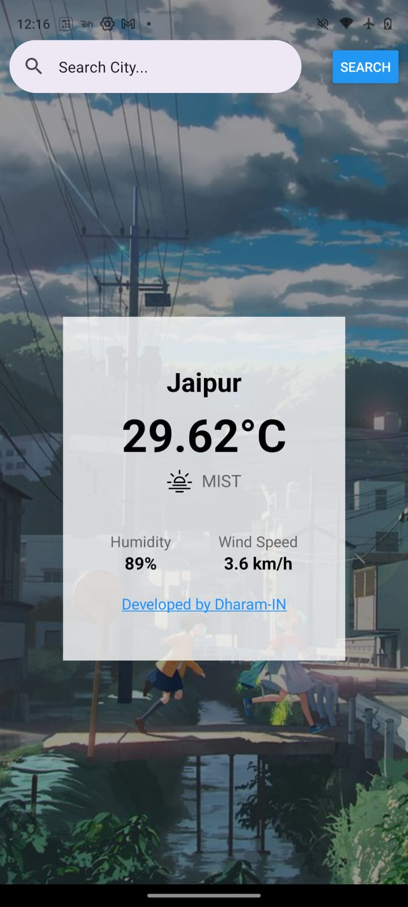
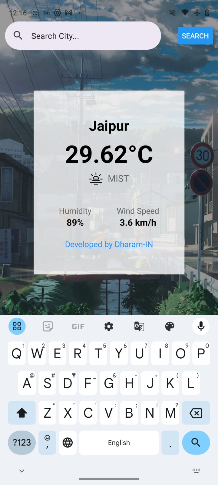
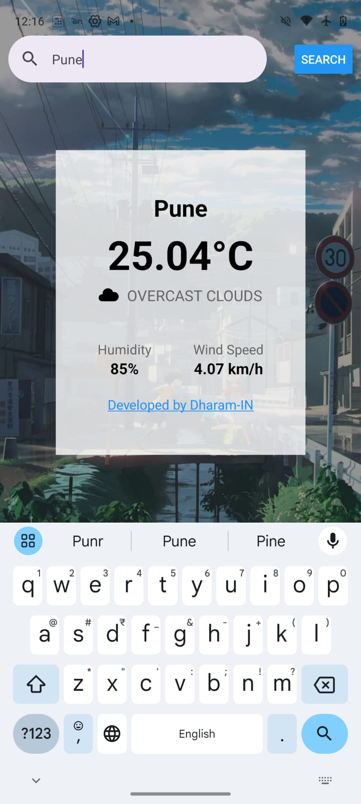

### Weather App and Todo App

#### About My Weather App
Welcome to my Weather App!

My Weather App provides real-time weather information using the OpenWeatherMap API. You can search for cities around the world and get detailed weather forecasts instantly.

#### Features
- **Real-Time Weather:** Get current weather conditions and forecasts for any city.
- **Search Functionality:** Search for cities by name to get weather information.
- **Detailed Weather Info:** View temperature, humidity, wind speed, and more.
- **User-Friendly Interface:** Intuitive design for seamless weather browsing.
- **Reliable Data:** Weather data sourced from OpenWeatherMap, ensuring accuracy.

#### Why Choose My Weather App?
- **Instant Updates:** Stay informed with up-to-date weather information.
- **Easy to Use:** Simple navigation for effortless weather checking.
- **Customization:** Save favorite cities for quick access to weather updates.
- **Secure:** Your data is handled securely, ensuring privacy.

#### Screenshots




#### Get Started
Ready to check the weather or explore new cities? Download My Weather App today and stay informed about weather conditions worldwide!

#### How to Install and Run
1. Ensure you have Node.js installed on your machine.
2. Install Expo CLI globally:
   ```sh
   npm install -g expo-cli
   ```
3. Clone this repository to your local machine:
   ```sh
   git clone https://github.com/Dharam-In/React-Native-Learn
   ```
4. Navigate to the project directory:
   ```sh
   cd weatherapp
   ```
5. Install dependencies:
   ```sh
   npm install
   # or
   yarn install
   ```
6. Start the Expo development server:
   ```sh
   expo start
   ```
7. Use the Expo Go app on your smartphone to scan the QR code and open the app.

#### Deployment
To deploy your own version of My Weather App:
1. Sign up for an Expo account and follow their deployment guides.
2. Build the app using `expo build`.

#### Credits
- **React Native:** Framework for building native mobile apps using React.
- **Expo:** Toolchain for simplifying React Native development.
- **OpenWeatherMap API:** Provides weather data used in this app.
- **AsyncStorage:** For storing favorite cities locally.

#### Author
- Dharam-IN

Feel free to customize this README file according to your project's specifics and preferences.

---